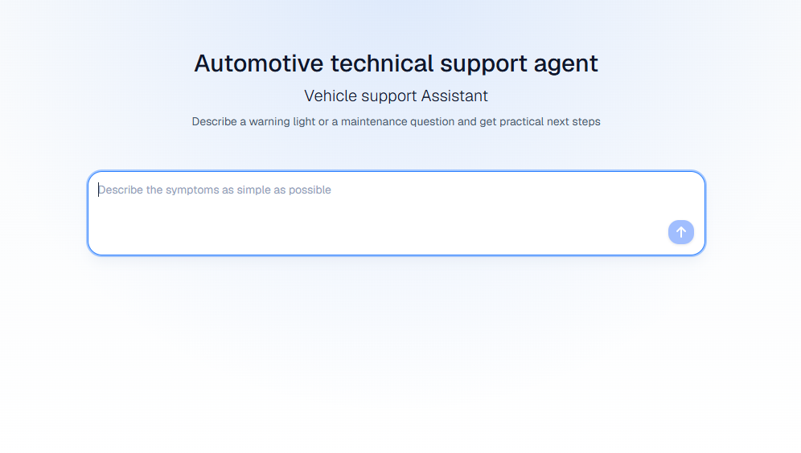
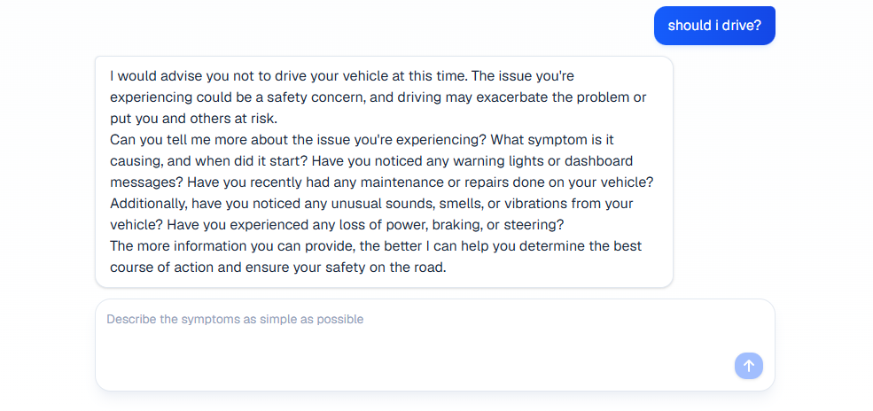

# Automotive Technical Support Chatbot

A full-stack automotive technical support chatbot built with React, Express, Bun, and a local Ollama LLM. The assistant is designed to help users describe vehicle symptoms, warning lights, maintenance questions and then receive practical next steps.

The project runs locally and uses `llama3.2:1b` through Ollama.

## Features

- Automotive technical support chat interface
- Local LLM inference with Ollama
- Support knowledge loaded from markdown prompt files
- Express API for chat requests
- React/Vite frontend with a clean centered chat page
- Request validation with Zod
- Vite proxy from the client to the backend API

## Tech Stack

- Frontend: React, Vite, Tailwind CSS
- Backend: Bun, Express, TypeScript
- LLM: Ollama with `llama3.2:1b`
- Validation: Zod
- HTTP client: Axios

## Project Structure

```txt
packages/
  client/
    src/
      App.tsx
      components/chat/
  server/
    controllers/
    services/
    llm/
      client.ts
      prompts/
        SupportKnowledge.md
        technical_support_instructions.txt
```

## Prerequisites

Install:

- Bun
- Ollama

Then pull the local model:

```bash
ollama pull llama3.2:1b
```

You can test the model directly with:

```bash
ollama run llama3.2:1b
```

## Installation

From the project root:

```bash
bun install
```

## Run Locally

Start the backend:

```bash
cd packages/server
bun run dev
```

The backend runs on:

```txt
http://localhost:3000
```

Start the frontend in a second terminal:

```bash
cd packages/client
bun run dev
```

Open the URL printed by Vite, usually:

```txt
http://localhost:5173
```

## API Routes

Health check:

```http
GET /api/hello
```

Chat:

```http
POST /api/chat
```

Example request body:

```json
{
  "prompt": "My check engine light is flashing.",
  "conversationId": "550e8400-e29b-41d4-a716-446655440000"
}
```

Example response:

```json
{
  "message": "..."
}
```

## LLM Notes

This project uses Ollama locally. The backend calls the local Ollama service with:

```txt
llama3.2:1b
```

Because inference runs locally, a deployed static frontend will not have chatbot functionality unless the backend and Ollama service are also available.

## Prompt Files

The assistant behavior is controlled by:

```txt
packages/server/llm/prompts/technical_support_instructions.txt
packages/server/llm/prompts/SupportKnowledge.md
```

Update these files to change the assistant's support rules, domain knowledge, safety guidance, and escalation behavior.

## Screenshots



